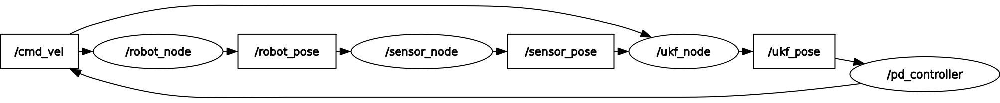
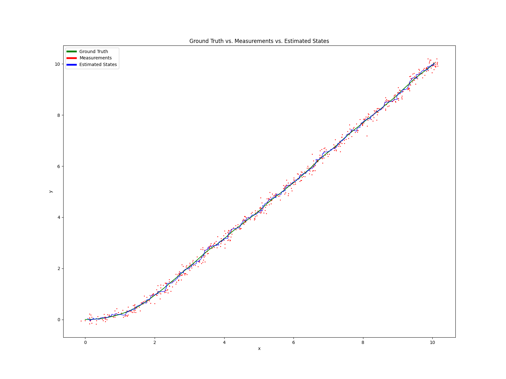

### Tracking unicycle robot with UKF

This project uses `ROS2` for simulating Robot, Sensor, PD Controller, and UKF. The idea of the project is as follows:-

- A unicycle robot is initialized at some point in 2D space (currently at the origin).
- The robot needs to go to a target location (currently at (10, 10)).
- The sensor adds some noise to the true state of the robot.
- UKF algorithm filters the noisy state and generates the estimated state.
- Using the estimated state, the PD controller computes and sends the control command to the robot to go to the desired location.

This is better visualized with the `rqt_graph` below:-



Below is a brief description of each scripts:-

#### `robot_node.py`

It creates a ROS2 node for representing a robot. The robot publishes its current state to the topic `/robot_pose`. It also susbcribes to the topic `/cmd_vel`, through which it receives the control commands. After receiving control commands, it uses unicycle dynamics to update its state. It does so periodically after time `dt`.

#### `sensor_node.py`

The purpose of the Sensor Node is to receive the true state of the robot from the topic `/robot_pose`, add Gaussian noise to the true state, and publish the noisy states (or measurements) to the topic `/sensor_pose`.

#### `controller.py`

The controller has the information about the target location of the robot, and it periodically receives the estimated state of the robot from `/ukf_pose`. Using these two information, it implements PD control algorithm to generate a Twist message containing the control commands `v` and `w`. It then sends these commands to `/cmd_vel` topic, which makes the robot move. 

#### `ukf.py`

It implements the `UKF` class. The `UKF` class has the mathematics behind the predict and update steps of the UKF algorithm.

#### `ukf_node.py`

It creates the node `UKFNode` that initializes the parameters for the UKF filter. It also defines the state transition function and the measurement function. It listens to the measurements and control commands from the topics `/sensor_pose` and `/cmd_vel` respectively. It then uses these information to produce an estimate of the robot's state and publishes the estimated state to the topic `/ukf_pose`.

### How to run the project?

Open a terminal, go to the directory `ros2_ws`, and run:

```cmd
colcon build
```

Then source the `setup.bash` file as follows:

```cmd
source install/setup.bash
```

Open three more terminals. In total, we need four for running each of robot, sensor, controller, and ukf nodes. After opening new terminals, source the `setup.bash` file as described above.

Run the following commands in each terminal separately:-

Terminal 1: 

```cmd
ros2 run ukf_project robot
```

Terminal 2: 

```cmd
ros2 run ukf_project sensor
```

Terminal 3: 

```cmd
ros2 run ukf_project controller
```

Terminal 4: 

```cmd
ros2 run ukf_project ukf
```

After this point, there should be data printed out to the terminal. To visualize the data, we need to store the data. `ros2 bags` are recommended for this purpose. We need to open another terminaland run the following command to store the data:

Terminal 5:

```cmd
ros2 bag record -o your_directory_name /robot /sensor /controller /ukf
```

This command should be run only when all the four commands in Terminals 1-4 are still running. 

This command will create a directory, which would have a file `xxxxx.db3`. We need to convert the data from this file into `.csv` files. There are multiple ways of doing so. The recommended way is to use the repository [ros2bag_convert](https://github.com/fishros/ros2bag_convert). After following the instructions from the repository, we would have three `.csv` files, namely `robot_pose.csv`, `sensor_pose.csv`, and `ukf_pose.csv`. Now, the script `support_python.py` has the files necessary to create a plot showing the ground truth, measurements, and estimated states of the robot. 

One such result is shown below:

